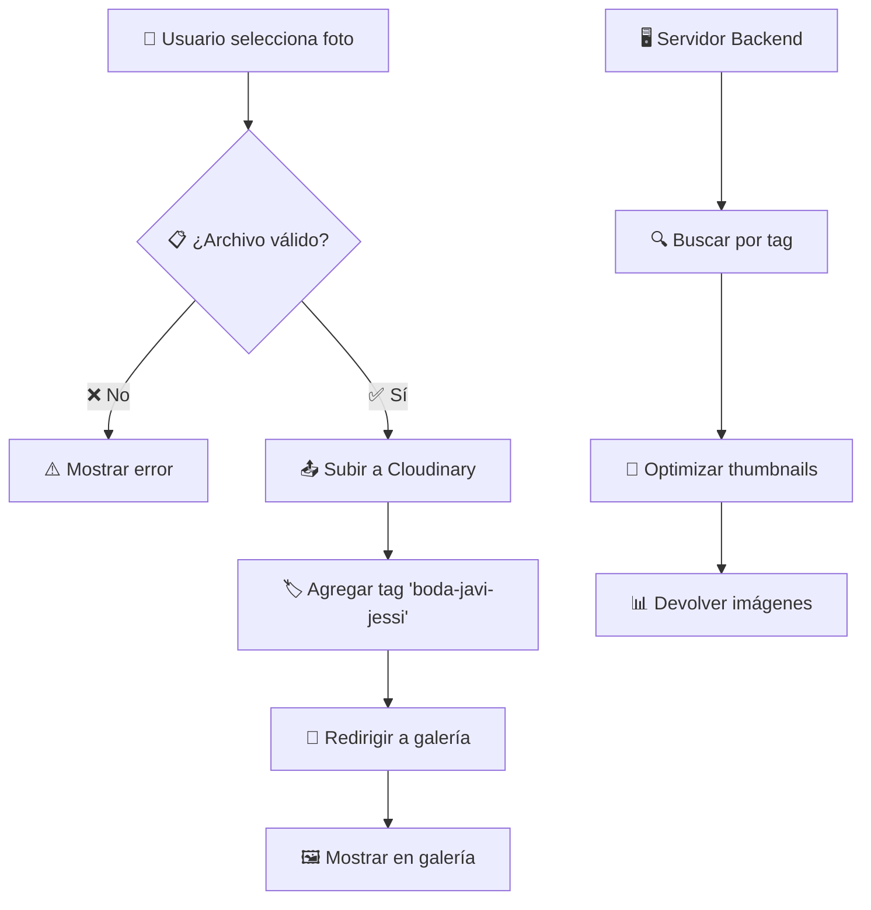

# 📸 Guía Completa de Cloudinary para la Boda de Javier & Jessica

## ¿Qué es Cloudinary?

Cloudinary es una plataforma en la nube para gestión de imágenes y videos. Te permite:

- ✅ Subir imágenes de forma segura
- 🔄 Optimizar automáticamente las imágenes
- 🌐 Distribuir contenido globalmente
- 📱 Adaptar imágenes para diferentes dispositivos

## 🎯 Funcionalidades Implementadas

### **Frontend (React)**

- **Subida de fotos con validación** 📤
  - Tipos permitidos: JPG, PNG, GIF, WebP
  - Tamaño máximo: 10MB
  - Barra de progreso visual
  - Manejo de errores mejorado

### **Backend (Express + Cloudinary)**

- **API para obtener imágenes** 🖼️
  - Endpoint: `/images` - Lista todas las fotos
  - Endpoint: `/stats` - Estadísticas de la galería
  - Endpoint: `/health` - Estado del servidor
  - Optimización automática de thumbnails

### **Galería Mejorada**

- **Vista responsive** 📱
  - Grid adaptable
  - Lazy loading
  - Overlay con acciones
  - Estados de carga y error

## 🚀 Configuración e Instalación

### 1. **Configurar Cloudinary**

1. Crea una cuenta en https://cloudinary.com
2. Ve al Dashboard y anota estos valores:
   - **Cloud Name**: `dsnngazeg` (ya configurado)
   - **API Key**: tu clave única
   - **API Secret**: tu clave secreta

### 2. **Configurar Variables de Entorno**

Crea el archivo `cloudinary-server/.env`:

```env
CLOUDINARY_CLOUD_NAME=dsnngazeg
CLOUDINARY_API_KEY=tu_api_key_aqui
CLOUDINARY_API_SECRET=tu_api_secret_aqui
PORT=4000
```

### 3. **Instalar Dependencias**

```bash
# Frontend
npm install

# Backend
cd cloudinary-server
npm install
```

### 4. **Ejecutar la Aplicación**

```bash
# Terminal 1: Servidor Backend
cd cloudinary-server
npm start

# Terminal 2: Frontend
npm run dev
```

## 🔧 Configuración de Upload Preset

En tu dashboard de Cloudinary:

1. Ve a **Settings → Upload**
2. Busca **Upload presets**
3. Verifica que existe `boda-javi-jessi` con estas configuraciones:
   - **Signing Mode**: Unsigned
   - **Tags**: `boda-javi-jessi`
   - **Folder**: (opcional) `bodas/javier-jessica/`

## 📋 Flujo de la Aplicación



## 🛠️ Características Técnicas

### **Validaciones de Archivo**

```javascript
const maxSize = 10 * 1024 * 1024; // 10MB
const allowedTypes = ["image/jpeg", "image/png", "image/gif", "image/webp"];
```

### **Optimización de Imágenes**

```javascript
thumbnail_url: cloudinary.url(img.public_id, {
  width: 300,
  height: 300,
  crop: "fill",
  quality: "auto",
  format: "auto",
});
```

### **Tags para Organización**

- Todas las fotos tienen el tag `boda-javi-jessi`
- Facilita la búsqueda y filtrado
- Separación de contenido por eventos

## 🔍 Endpoints de la API

### `GET /health`

Estado del servidor

```json
{
  "status": "ok",
  "message": "Servidor funcionando",
  "cloudName": "dsnngazeg"
}
```

### `GET /images`

Lista de fotos de la boda

```json
[
  {
    "public_id": "muestra_id",
    "secure_url": "https://...",
    "thumbnail_url": "https://...",
    "format": "jpg",
    "width": 1920,
    "height": 1080,
    "created_at": "2024-01-01T00:00:00Z"
  }
]
```

### `GET /stats`

Estadísticas de la galería

```json
{
  "total_images": 25,
  "last_updated": "2024-01-01T00:00:00Z"
}
```

## ⚠️ Solución de Problemas

### **Error: "El servidor no está disponible"**

```bash
# Verificar que el servidor esté ejecutándose
cd cloudinary-server
npm start
```

### **Error: "Faltan variables de entorno"**

```bash
# Crear el archivo .env con las credenciales correctas
echo "CLOUDINARY_CLOUD_NAME=dsnngazeg" > .env
echo "CLOUDINARY_API_KEY=tu_key" >> .env
echo "CLOUDINARY_API_SECRET=tu_secret" >> .env
```

### **Error: "Error al subir imagen"**

- ✅ Verifica tu conexión a internet
- ✅ Comprueba que el upload preset existe
- ✅ Revisa que el archivo sea válido

## 🌟 Mejoras Implementadas

### ✅ **Frontend**

- Validación de archivos
- Barra de progreso
- Estados de carga
- Mejor UX/UI
- Manejo de errores

### ✅ **Backend**

- Verificación de conexión
- Múltiples endpoints
- Optimización de imágenes
- Logs informativos
- Manejo de errores

### ✅ **Galería**

- Thumbnails optimizados
- Lazy loading
- Overlay interactivo
- Responsive design
- Fallback methods

## 🎨 Personalización

### **Cambiar colores del tema:**

```scss
// En _gallery.scss y _header.scss
$primary-color: #8b4513; // Marrón elegante
$background-color: antiquewhite;
```

### **Modificar tamaños de imagen:**

```javascript
// En cloudinary-server/index.js
thumbnail_url: cloudinary.url(img.public_id, {
  width: 400, // Cambiar ancho
  height: 400, // Cambiar alto
  crop: "fill",
});
```

## 📞 Soporte

Si tienes problemas:

1. Revisa los logs del servidor
2. Verifica la consola del navegador
3. Comprueba las credenciales de Cloudinary
4. Asegúrate de que el upload preset esté configurado

---

💕 **¡Disfruta compartiendo los recuerdos de la boda de Javier & Jessica!** 📸
